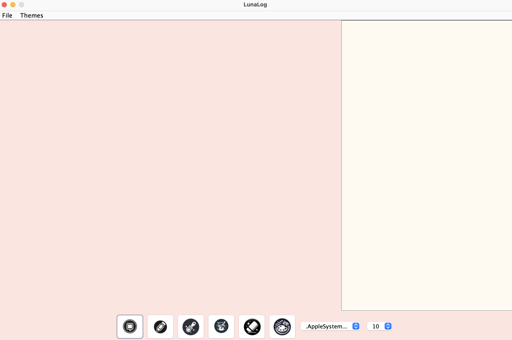
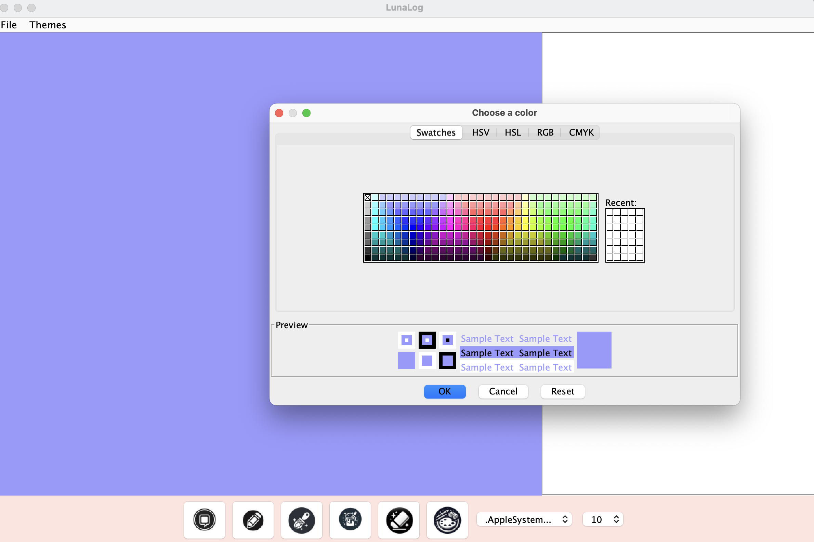

# 📖 LunaLog - Digital Journal & Sketchbook  
*A hybrid Java Swing application for expressive journaling with rich text and drawing tools*




## ✨ Features  
**🎨 Dual-Mode Interface**  
- **Rich Text Editor** with font customization  
- **Drawing Canvas** with multiple tools (Pencil, Paintbrush, Eraser, Paint Bucket)  

**🌈 Themed Experiences**  
- 6 aesthetic themes: Cyberpunk, Pastel, Cottagecore, Monochrome, Oceanic, Retro  
- Full UI color customization (backgrounds, text, menus)  

**💾 Smart Journal Management**  
- **SQLite Database** for local entry storage  
- Save entries as compressed `.journal` files (text + drawings combined in ZIP format)  
- Load previous entries from database or file system  
- Title-based organization system  


**✏️ Creative Tools**  
- Advanced color picker with full RGB spectrum  
- Adjustable eraser sizes (10px to 50px)  
- Smooth drawing algorithms for natural strokes  
- Paint Bucket tool for quick fills  
  

## 🛠 Tech Stack  
      

```
package com.yourname.journalapp;


import java.awt.BasicStroke;
import java.awt.BorderLayout;
import java.awt.Color;
import java.awt.Component;
import java.awt.Dimension;
import java.awt.FlowLayout;
import java.awt.Graphics;
import java.awt.Graphics2D;
import java.awt.GraphicsEnvironment;
import java.awt.Image;
import java.awt.Point;
import java.awt.event.ActionListener;
import java.awt.event.MouseAdapter;
import java.awt.event.MouseEvent;
import java.awt.event.MouseMotionAdapter;
import java.awt.image.BufferedImage;
import java.io.File;
import java.io.FileInputStream;
import java.io.FileOutputStream;
import java.io.IOException;
import java.sql.SQLException;
import java.util.List;
import java.util.zip.ZipEntry;
import java.util.zip.ZipInputStream;
import java.util.zip.ZipOutputStream;

import javax.imageio.ImageIO;
import javax.swing.ImageIcon;
import javax.swing.JButton;
import javax.swing.JColorChooser;
import javax.swing.JComboBox;
import javax.swing.JFileChooser;
import javax.swing.JFrame;
import javax.swing.JLabel;
import javax.swing.JMenu;
import javax.swing.JMenuBar;
import javax.swing.JMenuItem;
import javax.swing.JOptionPane;
import javax.swing.JPanel;
import javax.swing.JScrollPane;
import javax.swing.JTextArea;
import javax.swing.JTextPane;
import javax.swing.SwingUtilities;
import javax.swing.text.StyleConstants;
import javax.swing.text.StyledDocument;


public class JournalApp extends JFrame {

    private JTextPane textPane;
    private JPanel centerToolPanel;
    private DrawingPanel drawingPanel;
    private Color currentColor = Color.BLACK;
    private String currentTool = "Text";
    private JMenuBar menuBar;

    public JournalApp() {
        setTitle("LunaLog");
        setSize(1200, 800);
        setResizable(false); // Prevent resizing
        setDefaultCloseOperation(JFrame.EXIT_ON_CLOSE);
        setLayout(new BorderLayout());

        try {
            DatabaseHelper.initializeDatabase();
        } catch (SQLException e) {
            JOptionPane.showMessageDialog(this,
                 "Database initialization failed:\n" + e.getMessage(), 
                 "Database Error", 
                 JOptionPane.ERROR_MESSAGE);
            System.exit(1);
    }

       


        // Text pane for typing
        textPane = new JTextPane();
        JScrollPane scrollPane = new JScrollPane(textPane);
        scrollPane.setPreferredSize(new Dimension(400, 600));
        add(scrollPane, BorderLayout.EAST);

        // Drawing panel setup
        drawingPanel = new DrawingPanel();
        drawingPanel.setPreferredSize(new Dimension(800, 800));
        add(drawingPanel, BorderLayout.CENTER);

        // Center tool panel for icons and font selection
        centerToolPanel = new JPanel(new FlowLayout(FlowLayout.CENTER));
        add(centerToolPanel, BorderLayout.SOUTH);
        addToolIcons(centerToolPanel);
        addFontSelectors(centerToolPanel);

        // Menu bar setup
        menuBar = createMenuBar();
        setJMenuBar(menuBar);

        // Center the window on the screen
        setLocationRelativeTo(null);
    }

    private void addToolIcons(JPanel panel) {
        panel.add(createToolIcon("/Users/mo/Desktop/Journal/Journal/src/main/resources/icons/textbox.png", e -> setCurrentTool("Text")));
        panel.add(createToolIcon("/Users/mo/Desktop/Journal/Journal/src/main/resources/icons/pencil.png", e -> setCurrentTool("Pencil")));
        panel.add(createToolIcon("/Users/mo/Desktop/Journal/Journal/src/main/resources/icons/paintbrush.png", e -> setCurrentTool("Paintbrush")));
        panel.add(createToolIcon("/Users/mo/Desktop/Journal/Journal/src/main/resources/icons/paintbucket.png", e -> setCurrentTool("PaintBucket")));
        panel.add(createToolIcon("/Users/mo/Desktop/Journal/Journal/src/main/resources/icons/eraser.png", e -> setCurrentTool("Eraser")));
        panel.add(createToolIcon("/Users/mo/Desktop/Journal/Journal/src/main/resources/icons/palette.png", e -> chooseColor()));

        // Add eraser size control
        JComboBox<Integer> sizeCombo = new JComboBox<>(new Integer[]{10, 20, 30, 50});
        sizeCombo.setSelectedItem(20);
        sizeCombo.addActionListener(e -> {
            drawingPanel.setEraserSize((Integer)sizeCombo.getSelectedItem());
        });
        panel.add(new JLabel("Eraser Size:"));
        panel.add(sizeCombo);
    }

    private JButton createToolIcon(String iconFile, ActionListener action) {
        ImageIcon icon = new ImageIcon(iconFile);
        Image scaledImage = icon.getImage().getScaledInstance(50, 50, Image.SCALE_SMOOTH);
        JButton button = new JButton(new ImageIcon(scaledImage));
        button.addActionListener(action);
        return button;
    }

    private void addFontSelectors(JPanel panel) {
        // Font selection dropdown
        String[] fonts = GraphicsEnvironment.getLocalGraphicsEnvironment().getAvailableFontFamilyNames();
        JComboBox<String> fontDropdown = new JComboBox<>(fonts);
        fontDropdown.setPreferredSize(new Dimension(150, 30));
        fontDropdown.addActionListener(e -> updateTextFont(fontDropdown.getSelectedItem().toString(), null));
        panel.add(fontDropdown);

        // Font size dropdown
        Integer[] fontSizes = {10, 12, 14, 16, 18, 20, 24, 28, 32, 36};
        JComboBox<Integer> fontSizeDropdown = new JComboBox<>(fontSizes);
        fontSizeDropdown.setPreferredSize(new Dimension(70, 30));
        fontSizeDropdown.addActionListener(e -> updateTextFont(null, (Integer) fontSizeDropdown.getSelectedItem()));
        panel.add(fontSizeDropdown);
    }

    private void updateTextFont(String fontName, Integer fontSize) {
        StyledDocument doc = textPane.getStyledDocument();
        javax.swing.text.Style style = textPane.addStyle("FontStyle", null);

        if (fontName != null) {
            StyleConstants.setFontFamily(style, fontName);
        }
        if (fontSize != null) {
            StyleConstants.setFontSize(style, fontSize);
        }

        textPane.setCharacterAttributes(style, true);
    }

    private JMenuBar createMenuBar() {
        JMenuBar menuBar = new JMenuBar();

        JMenu fileMenu = new JMenu("File");
        JMenuItem newItem = new JMenuItem("New");
        JMenuItem saveItem = new JMenuItem("Save");
        JMenuItem openItem = new JMenuItem("Open");
        saveItem.addActionListener(e -> saveEntry());
        fileMenu.add(newItem);
        fileMenu.add(saveItem);
        
    openItem.addActionListener(e -> loadEntries());
    fileMenu.add(openItem);
    
        menuBar.add(fileMenu);

        JMenu themesMenu = new JMenu("Themes");
        JMenuItem pastelTheme = new JMenuItem("Pastel");
        JMenuItem cyberpunkTheme = new JMenuItem("Cyberpunk");
        JMenuItem cottagecoreTheme = new JMenuItem("Cottagecore");
        JMenuItem monochromeTheme = new JMenuItem("Monochrome");
        JMenuItem oceanicTheme = new JMenuItem("Oceanic");
        JMenuItem retroTheme = new JMenuItem("Retro");
        pastelTheme.addActionListener(e -> setTheme("Pastel"));
        cyberpunkTheme.addActionListener(e -> setTheme("Cyberpunk"));
        cottagecoreTheme.addActionListener(e -> setTheme("Cottagecore"));
        monochromeTheme.addActionListener(e -> setTheme("Monochrome"));
        oceanicTheme.addActionListener(e -> setTheme("Oceanic"));
        retroTheme.addActionListener(e -> setTheme("Retro"));
        themesMenu.add(pastelTheme);
        themesMenu.add(cyberpunkTheme);
        themesMenu.add(cottagecoreTheme);
        themesMenu.add(monochromeTheme);
        themesMenu.add(oceanicTheme);
        themesMenu.add(retroTheme);
        menuBar.add(themesMenu);

        return menuBar;
    }

    
    

    private void setTheme(String theme) {
    Color backgroundColor;
    Color textPaneColor;
    Color textColor;
    Color menuBarColor;
    
    switch (theme) {
        case "Pastel":
            backgroundColor = new Color(255, 228, 225);
            textPaneColor = new Color(255, 250, 240);
            textColor = Color.BLACK;
            menuBarColor = new Color(255, 228, 225);  // Light pink for menu
            break;
        case "Cyberpunk":
            backgroundColor = new Color(12, 12, 50);
            textPaneColor = new Color(34, 34, 74);
            textColor = Color.GREEN;
            menuBarColor = new Color(34, 34, 74);  // Dark blue for menu
            break;
        case "Cottagecore":
            backgroundColor = new Color(250, 240, 215);
            textPaneColor = new Color(240, 230, 220);
            textColor = Color.DARK_GRAY;
            menuBarColor = new Color(250, 240, 215);  // Soft beige for menu
            break;
        case "Monochrome":
            backgroundColor = Color.BLACK;
            textPaneColor = Color.DARK_GRAY;
            textColor = Color.WHITE;
            menuBarColor = Color.DARK_GRAY;  // Dark gray for menu
            break;
        case "Oceanic":
            backgroundColor = new Color(0, 105, 148);
            textPaneColor = new Color(0, 168, 232);
            textColor = Color.WHITE;
            menuBarColor = new Color(0, 168, 232);  // Light blue for menu
            break;
        case "Retro":
            backgroundColor = new Color(255, 204, 0);
            textPaneColor = new Color(255, 239, 173);
            textColor = Color.BLACK;
            menuBarColor = new Color(255, 239, 173);  // Light yellow for menu
            break;
        default:
            return;
    }

    // Update background and foreground for the main content
    getContentPane().setBackground(backgroundColor);
    centerToolPanel.setBackground(backgroundColor);
    textPane.setBackground(textPaneColor);
    textPane.setForeground(textColor);
    
    // Update the menu bar's colors
    menuBar.setBackground(menuBarColor);
    menuBar.setForeground(textColor);

    // Update colors for buttons and combo boxes in the center tool panel
    for (Component c : centerToolPanel.getComponents()) {
        if (c instanceof JButton || c instanceof JComboBox) {
            c.setBackground(backgroundColor);
            c.setForeground(textColor);
        }
    }

    // Repaint to apply the changes
    repaint();
}


    private void setCurrentTool(String tool) {
        this.currentTool = tool;
        drawingPanel.setCurrentTool(tool);
        if ("Text".equals(tool)) {
            drawingPanel.setVisible(false);
            textPane.setVisible(true);
        } else {
            drawingPanel.setVisible(true);
            textPane.setVisible(false);
        }
    }

    private void chooseColor() {
        Color selectedColor = JColorChooser.showDialog(this, "Choose a color", currentColor);
        if (selectedColor != null) {
            currentColor = selectedColor;
            drawingPanel.setCurrentColor(selectedColor);
            textPane.setForeground(selectedColor); // Set font color
        }
    }

    private void saveEntry() {
        String content = textPane.getText();
        String title = JOptionPane.showInputDialog("Enter title for the entry:");
        
        if (title == null || title.isEmpty() || content.isEmpty()) {
            JOptionPane.showMessageDialog(this, "Title and content cannot be empty!");
            return;
        }

        try {
            // Save to database
            DatabaseHelper.saveJournalEntry(title, content, null);
            
            // Save as .journal file
            JFileChooser fileChooser = new JFileChooser();
            fileChooser.setSelectedFile(new File(title + ".journal"));
            
            if (fileChooser.showSaveDialog(this) == JFileChooser.APPROVE_OPTION) {
                saveJournalToFile(fileChooser.getSelectedFile(), content);
                JOptionPane.showMessageDialog(this, "Entry saved successfully!");
            }
        } catch (Exception e) {
            JOptionPane.showMessageDialog(this, 
                "Error saving entry: " + e.getMessage(), 
                "Error", 
                JOptionPane.ERROR_MESSAGE);
        }
    }

    private void saveJournalToFile(File file, String content) {
        try (ZipOutputStream zos = new ZipOutputStream(new FileOutputStream(file))) {
            // Save text
            zos.putNextEntry(new ZipEntry("content.txt"));
            zos.write(content.getBytes());
            zos.closeEntry();
            
            // Save drawing
            if (drawingPanel.getCanvas() != null) {
                zos.putNextEntry(new ZipEntry("drawing.png"));
                ImageIO.write(drawingPanel.getCanvas(), "png", zos);
                zos.closeEntry();
            }
        } catch (IOException e) {
            JOptionPane.showMessageDialog(this, 
                "File save error: " + e.getMessage(), 
                "Error", 
                JOptionPane.ERROR_MESSAGE);
        }
    }

    private void loadEntries() {
        try {
            List<String> entries = DatabaseHelper.getJournalEntries();
            
            if (entries.isEmpty()) {
                int choice = JOptionPane.showConfirmDialog(this, 
                    "No entries found. Load from file instead?", 
                    "No Entries", 
                    JOptionPane.YES_NO_OPTION);
                
                if (choice == JOptionPane.YES_OPTION) {
                    openJournalEntry();
                }
                return;
            }

            // Display entries
            JTextArea entriesArea = new JTextArea();
            entries.forEach(entry -> entriesArea.append(entry + "\n\n"));
            
            JScrollPane scrollPane = new JScrollPane(entriesArea);
            scrollPane.setPreferredSize(new Dimension(600, 400));
            JOptionPane.showMessageDialog(this, scrollPane, "Your Entries", JOptionPane.PLAIN_MESSAGE);
        } catch (Exception e) {
            JOptionPane.showMessageDialog(this, 
                "Error loading entries: " + e.getMessage(), 
                "Error", 
                JOptionPane.ERROR_MESSAGE);
        }
    }

    private void openJournalEntry() {
        JFileChooser fileChooser = new JFileChooser();
        fileChooser.setFileFilter(new javax.swing.filechooser.FileNameExtensionFilter(
            "Journal Files", "journal"));
        
        if (fileChooser.showOpenDialog(this) == JFileChooser.APPROVE_OPTION) {
            loadJournalFromFile(fileChooser.getSelectedFile());
        }
    }

    private void loadJournalFromFile(File file) {
        try (ZipInputStream zis = new ZipInputStream(new FileInputStream(file))) {
            ZipEntry entry;
            while ((entry = zis.getNextEntry()) != null) {
                if (entry.getName().equals("content.txt")) {
                    textPane.setText(new String(zis.readAllBytes()));
                } else if (entry.getName().equals("drawing.png")) {
                    drawingPanel.setCanvas(ImageIO.read(zis));
                }
            }
        } catch (IOException e) {
            JOptionPane.showMessageDialog(this, 
                "Error loading file: " + e.getMessage(), 
                "Error", 
                JOptionPane.ERROR_MESSAGE);
        }
    }

    public static void main(String[] args) {
        SwingUtilities.invokeLater(() -> {
            JournalApp app = new JournalApp();
            app.setVisible(true);
        });
    }
}
class DrawingPanel extends JPanel {
    private String currentTool = "Pencil";
    private Color currentColor = Color.BLACK;
    private int eraserSize = 20;
    private Point lastEraserPoint = null;
    private boolean showEraserPreview = false;
    private Point currentEraserPosition = null;
    private BufferedImage canvas;
    private Graphics2D g2d;
    private int prevX, prevY;

    public DrawingPanel() {
        setBackground(Color.WHITE);
        setPreferredSize(new Dimension(800, 800));

        canvas = new BufferedImage(800, 800, BufferedImage.TYPE_INT_ARGB);
        g2d = canvas.createGraphics();
        g2d.setColor(Color.WHITE);
        g2d.fillRect(0, 0, canvas.getWidth(), canvas.getHeight());
        g2d.setColor(currentColor);

        addMouseListener(new MouseAdapter() {
            @Override
            public void mousePressed(MouseEvent e) {
                prevX = e.getX();
                prevY = e.getY();
                if ("PaintBucket".equals(currentTool)) {
                    fillArea(e.getX(), e.getY(), currentColor);
                }
                if ("Eraser".equals(currentTool)) {
                    lastEraserPoint = new Point(e.getX(), e.getY()); // Initialize
                    currentEraserPosition = new Point(e.getX(), e.getY());
                }
            }
            
            @Override
            public void mouseReleased(MouseEvent e) {
                lastEraserPoint = null; 
            }
        });

        addMouseMotionListener(new MouseMotionAdapter() {
            @Override
            public void mouseDragged(MouseEvent e) {
                int x = e.getX();
                int y = e.getY();
                
                if ("Pencil".equals(currentTool)) {
                    g2d.setStroke(new BasicStroke(2));
                    g2d.drawLine(prevX, prevY, x, y);
                } 
                else if ("Paintbrush".equals(currentTool)) {
                    g2d.setStroke(new BasicStroke(15));
                    g2d.drawLine(prevX, prevY, x, y);
                } 
                else if ("Eraser".equals(currentTool)) {
                    // Smooth eraser implementation
                    g2d.setColor(getBackground());
                    g2d.setStroke(new BasicStroke(eraserSize, BasicStroke.CAP_ROUND, BasicStroke.JOIN_ROUND));
                    
                    // Connect the dots for smooth erasing
                    if (lastEraserPoint != null) {
                        g2d.drawLine(lastEraserPoint.x, lastEraserPoint.y, x, y);
                    } else {
                        g2d.fillOval(x - eraserSize/2, y - eraserSize/2, eraserSize, eraserSize);
                    }
                    g2d.setColor(currentColor);
                    lastEraserPoint = new Point(x, y); // Update last point
                    currentEraserPosition = new Point(x, y); // For preview
                }
                prevX = x;
                prevY = y;
                repaint();
            }
        });
    }

    public void setEraserSize(int size) {
        this.eraserSize = Math.max(5, size);
    }

    public void setCurrentTool(String tool) {
        this.currentTool = tool;
    }

    public void setCurrentColor(Color color) {
        this.currentColor = color;
        g2d.setColor(color);
    }

    public BufferedImage getCanvas() {
        return canvas;
    }

    public void setCanvas(BufferedImage newCanvas) {
        this.canvas = newCanvas;
        this.g2d = newCanvas.createGraphics();
        repaint();
    }
    
    @Override
    protected void paintComponent(Graphics g) {
        super.paintComponent(g);
        g.drawImage(canvas, 0, 0, null);
    }

    private void fillArea(int x, int y, Color fillColor) {
        g2d.setColor(fillColor);
        g2d.fillRect(0, 0, getWidth(), getHeight());
        repaint();
    }
}

```
## **🖥️ UI Components**
**DrawingPanel:** Handles all drawing operations with mouse listeners

**JTextPane:**	  Text editor with style support

**JToolBar:**	    Custom panel for brushes and font controls

**JMenuBar:**	    File operations and theme selection 

## **💫 How to Use**
1. **Write:** Type in the right panel with customizable fonts
2. **Draw:** Switch to canvas mode using toolbar
3. **Style:** Change themes via Themes Menu
4. **Save:** Database: Automatic title-based saving File: Export as .journal (ZIP with text + PNG)

## **🌟Getting Started**
**Requirements:** 
- Java 17+ JDK
- Maven (for building from source)

## **🛠️Run from source**
1. Clone the repository:
   ```git clone https://github.com/yourusername/LunaLog.git```
2. Build with Maven:
   ```mvn clean package```
3. Run the application
   ```java -jar target/journal-app-1.0.0.jar```

   
## **🤝 Contrinuting**
PRs welcome! To add:
- More brush types (spray, shapes)
- Cloud sync functionality
- PDF export
